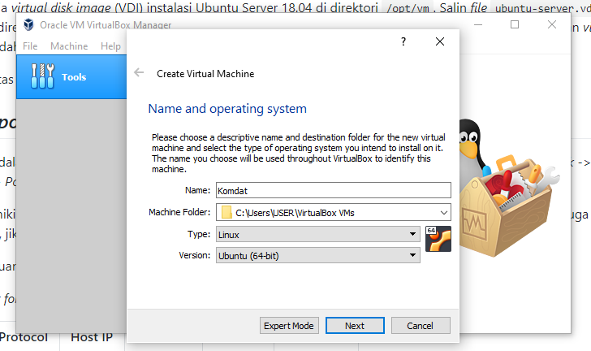
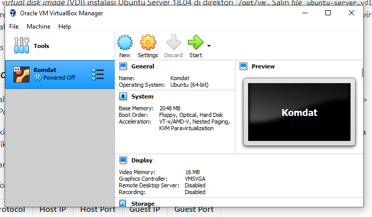
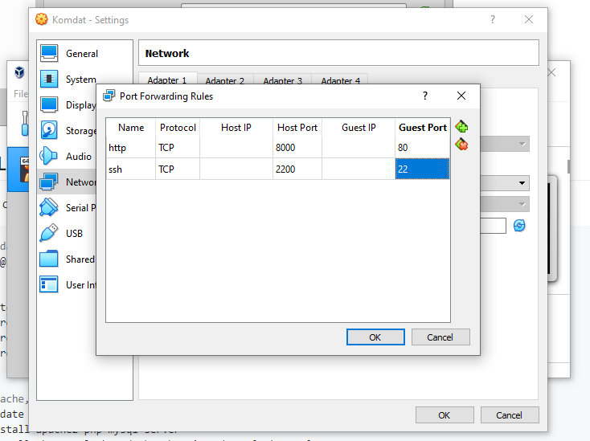
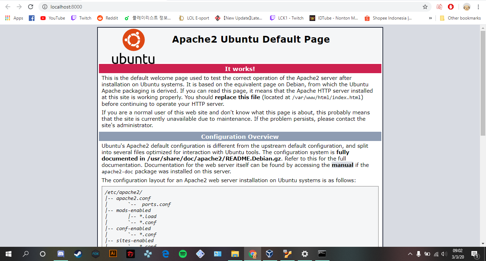
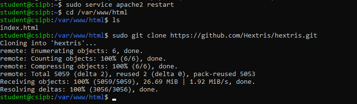

<p align="center">
  <a href="">
    
  </a>
</p>

# Sekilas Tentang
Hextris merupakan sebuah permainan berbasis web yang memiliki konsep seperti tetris, hanya saja dengan enam sisi yang harus diisi. Bila pemain dapat menyusun 3 atau lebih blok secara horizontal atau vertikal maka blok tersebut akan menghilang dan pemain mendapatkan poin, permainan berakhir apabila salah satu dari keenam sisi terisi penuh.

# Control
| Tombol Keyboard | Fungsi |
| ----- | ----- |
| Arrow Left atau A | Memutar Hexagon ke kiri |
| Arrow Right atau D | Memutar Hexagon ke kanan |
| Arrow Down atau S | Mempercepat blok turun |


# Instalasi
  Requirements : 
  Untuk menginstall Hextris membutuhkan beberapa hal, yaitu :
  1. Apache2
  2. PHP
  3. HTML5
  
# Konfigurasi
  - Dapat men-share score ke facebook dan twitter
  - Dapat membuka play store dan apps store
  
# Otomatisasi

## Instalasi Web Server Virtual
1. Membuat VM Ubuntu Server
Membuat VM baru pada VirtualBox dengan tipe "Ubuntu 64-bit", menggunakan virtual disk Ubuntu Server 18.04.




2. Setting Port-Forwarding VM
Tujuannya adalah agar VM bisa diakses dari luar melalui alamat IP host (localhost). Masuk ke 'Settings -> Network -> Advanced -> Port Forwarding' lalu ditambahkan dua aturan berikut.

  

3. Instalasi LAMP (Linux Apache MySQL PHP)
  ```bash
# akses vm dari host
ssh student@localhost -p 2200

# set repo
sudo tee /etc/apt/sources.list << !
deb http://repo.apps.cs.ipb.ac.id/ubuntu bionic          main restricted universe multiverse
deb http://repo.apps.cs.ipb.ac.id/ubuntu bionic-updates  main restricted universe multiverse
deb http://repo.apps.cs.ipb.ac.id/ubuntu bionic-security main restricted universe multiverse
!

# instal apache, mysql, php
sudo apt update
sudo apt upgrade
sudo apt install apache2 php mysql-server
sudo apt install php-mysql php-gd php-mbstring php-xml php-curl
sudo service apache2 restart
  ```

  

## Instalasi Hextris
1. Lakukan cd ke /var/www/html
2. Kemudian tuliskan command ls
3. Lakukan git clone <https://github.com/Hextris/hextris.git> 
4. Arahkan browser ke <http://localhost:8000/Hextris>

  


# Anggota Kelompok
| Nama | NIM | 
| ----- | ----- |
| Mickael | G64170039 | 
| Dharmawan Siswanto | G64170061 | 
| Daffa Wicaksono | G64170066 | 
| Muhamad Alif Hanif F | G64170084 | 

 # Referensi
- <https://github.com/auriza>
- <https://github.com/Hextris/hextris>

# Sitasi
```bash
@misc{engstrom2015hextris,
    author = {Logan Engstrom, Garrett Finucane, Noah Moroze, Michael Yang},
    title = {hextris},
    year = {2015},
    howpublished = {\url{https://github.com/hextris/hextris/}},
    note = {commit xxxxxxx}
  }
```

<p align="center">
  <a href="">
    
  </a>
</p>
